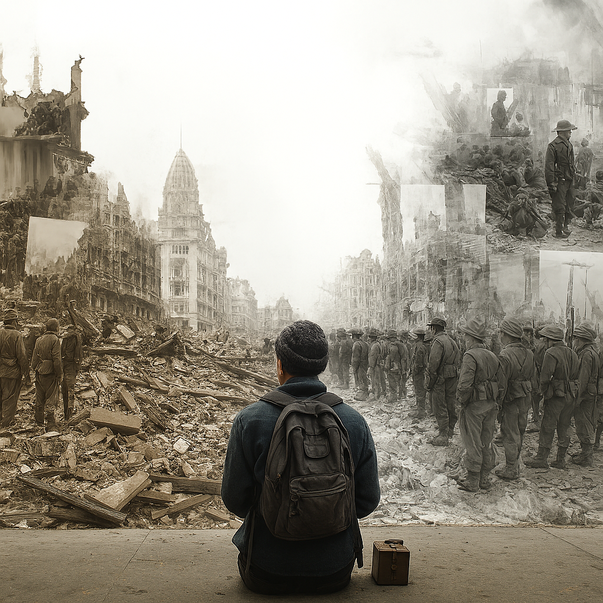

# 00 Why Do We Study History
*"Whenever the people are well informed, they can be trusted with their own government"* – Thomas Jefferson


<p style="text-align: center; font-style: italic; font-size: 1.1em;">The Cost of Forgetting</p>

---

<div style="background: linear-gradient(135deg, #8b0000 0%, #dc143c 25%, #ff6347 50%, #ffd700 75%, #32cd32 100%); padding: 25px; border-radius: 15px; margin: 20px 0; box-shadow: 0 10px 30px rgba(0,0,0,0.2);">
  <h3 style="color: white; margin-top: 0;">🔥 Why Do We Study History</h3>
  <audio controls preload="metadata" style="width: 100%; margin: 15px 0;">
    <source src="./audio/why_study_history_complete.mp3" type="audio/mpeg">
    <p style="color: white;">Audio playbook not supported. <a href="/audio/why_study_history_complete.mp3" download style="color: #ffd700;">Download the audio file</a></p>
  </audio>
  <p style="color: #e8e8e8; margin: 0; font-style: italic;">An exploration of why historical knowledge is a civic responsibility in a democracy, how societies remember—and forget—the past, and why fading memory of past horrors leaves us vulnerable to repetition.</p>
</div>

---

## ❓ Big Question

**How does our generation’s fading memory of past atrocities make us more vulnerable to their repetition?**

---

## 🏛️ Why Historical Literacy Matters

Studying history isn’t just an academic exercise—it’s a **civic necessity**.  
Without it, we risk becoming like individuals with **amnesia**—easily manipulated, unable to check falsehoods, and open to having our past rewritten for political purposes.

---

<h2>📜 The Difference Between Myth and History</h2>
<p>
Much of what Americans learn about their past in elementary and high school isn’t really history in the way professional historians approach it. Instead, it’s often a kind of “national myth” — a simplified, sanitized version designed to instill patriotic pride rather than critical understanding. While pride in one’s country isn’t inherently bad, when it’s based on incomplete or sugar-coated stories, it leaves citizens vulnerable to manipulation and ill-equipped to handle complexity.
</p>

<div style="background: linear-gradient(135deg, #8b0000 0%, #a83232 50%, #ff6347 100%); padding: 18px; border-radius: 12px; margin: 20px 0; border-left: 6px solid #ffd700; box-shadow: 0 6px 16px rgba(0,0,0,0.25);">
  <p style="color: #fff; margin: 0;">
    <strong>Example:</strong> The Boston Tea Party is often remembered as a heroic act of resistance — noble patriots dumping tea into Boston Harbor to protest British tyranny. But the historical reality was far more complex and morally ambiguous.
  </p>
</div>

<p>
The Sons of Liberty were what historians call an “extralegal group” — they operated outside and often in direct defiance of established legal and governmental structures. Many respectable colonists at the time actually viewed them as dangerous thugs rather than patriots. Their tactics included tarring and feathering people, burning the governor in effigy, destroying his house, stealing his property, sinking ships, and throwing rocks at soldiers.
</p>

<p>
Even prominent founders disagreed about their methods: John Adams called the Tea Party “magnificent” and “absolutely necessary,” while Benjamin Franklin was so concerned he offered to personally repay the East India Company for the destroyed tea. George Washington privately called the Bostonians “mad” and disapproved of destroying private property. Some Massachusetts towns formally condemned the Tea Party as “illegal and unjust.”
</p>

<div style="background: linear-gradient(135deg, #1e3c72 0%, #2a5298 50%, #1e3c72 100%); padding: 16px; border-radius: 10px; margin: 20px 0; border-left: 5px solid #ffd700;">
  <p style="color: #e8e8e8; margin: 0;">
    📌 <strong>Contemporary Relevance:</strong> The modern Tea Party movement, which emerged around 2009, explicitly associates itself with the Boston Tea Party “patriots” while ignoring the violent, controversial aspects of the original Sons of Liberty. This selective memory uses mythology rather than history to legitimize political action.
  </p>
</div>

<p>
This matters because without understanding the full historical context, citizens cannot properly evaluate whether modern political movements are grounding their claims in actual history or in convenient mythology that serves their purposes.
</p>

<p style="margin-top: 1.2em; font-style: italic; color: #555;">
  ➡️ Myths thrive where historical memory fades — and as our “Cost of Forgetting” shows, the less we remember the reality, the easier it becomes for dangerous patterns to reemerge.
</p>

<div style="background: linear-gradient(135deg, #1e3c72 0%, #2a5298 50%, #1e3c72 100%); padding: 20px; border-radius: 12px; margin: 20px 0; border-left: 6px solid #ffd700; box-shadow: 0 8px 20px rgba(0,0,0,0.2);">
  <p style="color: #fff; font-size: 1.05rem; margin-top: 0; font-style: italic;">
    "We're supposed to stand up to bullies, not follow them. We're supposed to stand up to discrimination, 
    and we're sure as heck supposed to stand up clearly and unequivocally to Nazi sympathizers. 
    How hard can that be? To say that Nazis are bad?"
  </p>
  <p style="color: #ffd700; font-weight: bold; margin: 0.5em 0 0 0;">— Barack Obama</p>
  <p style="color: #e8e8e8; font-size: 0.95rem; margin-top: 0.5em;">
    Obama delivered these words in August 2017 after the <em>Unite the Right</em> rally in Charlottesville, Virginia,
    where torch-bearing white supremacists marched openly through the city chanting racist and antisemitic slogans.
    His statement was a reminder that the moral clarity the world had after World War II—that Nazism was evil—is not permanent.
    It erodes if we stop teaching and remembering. Charlottesville showed that when historical memory fades,
    symbols and ideologies once universally condemned can reemerge in public without shame.
  </p>
</div>

---

## 🇩🇪 Germany’s Example

Germany has made confronting the crimes of the Nazi regime a **central part of public education**—not to glorify them, but to prevent their recurrence.  
They understand that the rise of Nazism in the 1930s was **not** due to forgetting—it was the product of deliberate choices by leaders and citizens who embraced racial hatred and authoritarian control.

---

⚠️ **Why This Matters Now**  
Our generation’s danger is different: the living memory of Nazi horrors is fading.  
As fewer people have a personal connection to World War II, society’s sensitivity to early warning signs diminishes. The less we remember the urgency of stopping such ideologies early, the more room they have to grow before they trigger alarm.

---

Within **months** of Hitler taking power in 1933:

- Democratic institutions were dismantled.
- Independent journalism was crushed.
- Propaganda replaced truth.

This was **a playbook**, not an accident—and without awareness of it, we are less equipped to recognize it when similar tactics appear today.

---

<div style="background: linear-gradient(135deg, #1e3c72 0%, #2a5298 50%, #1e3c72 100%); padding: 20px; border-radius: 10px; margin: 20px 0; border-left: 5px solid #ffd700;">
  <h4 style="color: white; margin-top: 0;">📈 Data Analysis: The Human Cost of Extremism</h4>
  <ul style="color: #e8e8e8;">
    <li><strong>Germany:</strong> 4.3–5.3 million military deaths in WWII; massive civilian losses and loss of territory.</li>
    <li><strong>United States:</strong> 400,000+ military deaths.</li>
    <li><strong>Soviet Union:</strong> Estimated 20–27 million dead.</li>
    <li><strong>Lesson:</strong> Extremist ideologies destroy their own societies as well as their intended victims. Forgetting these lessons risks repeating the cost.</li>
  </ul>
</div>

---

## ⚠️ Contemporary Parallels

When societies lose living memory of atrocities, their immunity to those dangers weakens.  
Today, extremist rhetoric that once would have met immediate public outrage can pass as “just another opinion.” That shift in sensitivity is itself a warning sign.

- **DHS reports**: White supremacist extremism is the most persistent U.S. domestic terror threat.
- **Anti-Semitic incidents**: Highest ever recorded levels.
- **Fintan O’Toole’s warning**: “Trial runs for fascism” normalize cruelty and dehumanization gradually.

---

<div style="background: linear-gradient(135deg, #660000 0%, #800000 50%, #660000 100%); padding: 18px; border-radius: 10px; margin: 20px 0; border-left: 5px solid #ffd700;">
  <h4 style="color: white; margin-top: 0;">🛑 Concept Spotlight: "Trial Runs for Fascism"</h4>
  <p style="color: #e8e8e8; margin: 0;">Extremists test boundaries, normalize cruelty, and desensitize the public before fully seizing power. Understanding these “trial runs” helps citizens spot early stages of democratic erosion.</p>
</div>

---

## 🛠️ Building Historical Literacy

Historical literacy means:

- Evaluating sources and evidence.
- Recognizing myth-making and selective narratives.
- Applying lessons from the past to today’s challenges.

The U.S. Founders applied lessons from **ancient Rome’s collapse** to design safeguards against dictatorship. We can—and must—do the same in our own time.

---

<div style="background: linear-gradient(135deg, #004d26 0%, #006633 50%, #004d26 100%); padding: 18px; border-radius: 10px; margin: 20px 0; border-left: 5px solid #ffd700;">
  <h4 style="color: white; margin-top: 0;">🏛️ Historical Connection: Lessons from Rome</h4>
  <p style="color: #e8e8e8; margin: 0;">The Founders studied how the Roman Republic fell to dictatorship and built checks and balances to prevent the same fate in America. Historical literacy means applying such lessons to modern threats before they can succeed.</p>
</div>

---

## 🔄 Visual Logic: How Forgetting Increases Risk

<!-- Inline SVG flow diagram -->
```{raw} html
<div style="margin: 22px 0; padding: 16px; border-radius: 12px; background: #0f172a; box-shadow: 0 10px 24px rgba(0,0,0,0.25);">
  <h4 style="color: #fff; margin: 0 0 10px 0;">🧭 From Fading Memory to Repetition Risk</h4>
  <svg viewBox="0 0 900 220" width="100%" height="auto" role="img" aria-label="Flow from fading memory to repetition risk">
    <defs>
      <linearGradient id="boxGrad1" x1="0" y1="0" x2="1" y2="1">
        <stop offset="0%" stop-color="#1e3c72"/>
        <stop offset="100%" stop-color="#2a5298"/>
      </linearGradient>
      <linearGradient id="boxGrad2" x1="0" y1="0" x2="1" y2="1">
        <stop offset="0%" stop-color="#7a1f1f"/>
        <stop offset="100%" stop-color="#a83232"/>
      </linearGradient>
      <linearGradient id="boxGrad3" x1="0" y1="0" x2="1" y2="1">
        <stop offset="0%" stop-color="#ff8c00"/>
        <stop offset="100%" stop-color="#ffd700"/>
      </linearGradient>
      <linearGradient id="boxGrad4" x1="0" y1="0" x2="1" y2="1">
        <stop offset="0%" stop-color="#0b6623"/>
        <stop offset="100%" stop-color="#32cd32"/>
      </linearGradient>
      <filter id="soft" x="-20%" y="-20%" width="140%" height="140%">
        <feDropShadow dx="0" dy="3" stdDeviation="4" flood-color="rgba(0,0,0,0.4)"/>
      </filter>
    </defs>

    <!-- Boxes -->
    <g filter="url(#soft)">
      <rect x="15"  y="60" width="200" height="80" rx="10" fill="url(#boxGrad1)"/>
      <rect x="245" y="60" width="200" height="80" rx="10" fill="url(#boxGrad2)"/>
      <rect x="475" y="60" width="200" height="80" rx="10" fill="url(#boxGrad3)"/>
      <rect x="705" y="60" width="200" height="80" rx="10" fill="url(#boxGrad4)"/>
    </g>

    <!-- Labels -->
    <g font-family="ui-sans-serif, system-ui, Segoe UI, Roboto, Helvetica, Arial" font-size="15" fill="#fff" text-anchor="middle">
      <text x="115" y="90" font-weight="700">Fading Memory</text>
      <text x="115" y="112">of Past Atrocities</text>

      <text x="345" y="88" font-weight="700">Lower Sensitivity</text>
      <text x="345" y="110">to Early Warning Signs</text>

      <text x="575" y="88" font-weight="700">Greater Vulnerability</text>
      <text x="575" y="110">to Manipulation/Normalization</text>

      <text x="805" y="88" font-weight="700">Repetition Risk</text>
      <text x="805" y="110">of Harmful Patterns</text>
    </g>

    <!-- Arrows -->
    <g stroke="#fff" stroke-width="3" fill="none" stroke-linecap="round">
      <line x1="215" y1="100" x2="245" y2="100"/>
      <line x1="445" y1="100" x2="475" y2="100"/>
      <line x1="675" y1="100" x2="705" y2="100"/>
    </g>
    <g fill="#fff">
      <polygon points="245,100 237,95 237,105"/>
      <polygon points="475,100 467,95 467,105"/>
      <polygon points="705,100 697,95 697,105"/>
    </g>

    <!-- Caption bullets -->
    <g font-family="ui-sans-serif, system-ui, Segoe UI, Roboto, Helvetica, Arial" font-size="13" fill="#e5e7eb">
      <text x="15" y="160">• Less lived experience ➜ fewer visceral guardrails</text>
      <text x="245" y="178">• Outrage threshold rises; propaganda feels “normal”</text>
      <text x="475" y="196">• Institutions erode quietly; civic reflexes dull</text>
      <text x="705" y="160">• Patterns don’t “repeat” exactly—but they rhyme</text>
    </g>
  </svg>
</div>
```
---

## 🌱 Resilience Through Action

Examples like the U.S. Civil Rights Movement show that **ordinary people**, using historical knowledge strategically, can achieve transformative change.

History is not only about **what happened**—it’s about **what we choose to make happen now**.

---

<div style="background: linear-gradient(135deg, #8b0000 0%, #ff4500 50%, #ffd700 100%); padding: 18px; border-radius: 12px; margin: 20px 0; border-left: 6px solid #ffd700; box-shadow: 0 8px 20px rgba(0,0,0,0.2);">
  <p style="color: #fff; font-size: 1.05rem; margin: 0;">
    There is <strong>no need</strong> to use AI tools to complete this lesson. You <em>may</em> use AI to help you <strong>format or polish</strong> your writing, but the ideas, analysis, and examples you submit must be entirely your own. Submitting AI-generated answers as your own work is considered academic dishonesty.
  </p>
</div>

---

## 📝 Lesson Checkpoint

<div style="background: linear-gradient(135deg, #2a5298 0%, #1e3c72 50%, #2a5298 100%); padding: 20px; border-radius: 14px; margin: 25px 0; border-left: 6px solid #ffd700; box-shadow: 0 10px 25px rgba(0,0,0,0.2);">
  <h3 style="color: white; margin-top: 0;">✅ Submit in Canvas</h3>
  <ol style="color: #e8e8e8;">
    <li>Explain the “memory” analogy for the role of history in a democracy. Why is it important?</li>
    <li>Why wasn’t the rise of Nazism in the 1930s the result of forgetting—and what is different about the danger we face today?</li>
    <li>Identify one modern parallel to historical extremist movements and explain how fading memory makes it more dangerous.</li>
    <li>Describe what “historical literacy” means and give an example of how it can be applied today.</li>
  </ol>
  <a href="https://sdccd.instructure.com/courses/2490206/assignments/21524810" style="display: inline-block; background: #ffd700; color: #000; padding: 12px 18px; border-radius: 8px; text-decoration: none; font-weight: bold; margin-top: 10px;">Open Canvas Assignment →</a>
</div>

<h2>📚 Glossary of Key Terms</h2>

<div style="background: #f9f9f9; border-radius: 12px; padding: 20px; border-left: 6px solid #ffd700; box-shadow: 0 6px 14px rgba(0,0,0,0.08); font-size: 1rem; line-height: 1.6;">

  <p><strong>Academic Integrity</strong> — The ethical principle that all work you submit should reflect your own thinking, research, and understanding. Using someone else’s work without proper attribution — including AI-generated text — is considered academic dishonesty.</p>

  <p><strong>Charlottesville “Unite the Right” Rally</strong> — A white supremacist rally held in August 2017 in Charlottesville, Virginia. It included neo-Nazis, Ku Klux Klan members, and other extremist groups, and resulted in violence and the murder of counter-protester Heather Heyer.</p>

  <p><strong>Contemporary Relevance</strong> — The way a historical event, idea, or theme connects to and informs current events, debates, or societal issues.</p>

  <p><strong>Extralegal Group</strong> — An organization or movement that operates outside the official legal framework, sometimes in open defiance of laws or government authority.</p>

  <p><strong>Historical Memory</strong> — The collective way societies remember and interpret the past, which can be shaped by education, media, commemorations, and political agendas.</p>

  <p><strong>Historical Myth</strong> — A simplified, selective, or sanitized version of history that may ignore complexity or inconvenient facts, often used to promote a particular political or cultural narrative.</p>

  <p><strong>Nazi Sympathizer</strong> — An individual or group that expresses support for, or refuses to condemn, Nazi ideology, policies, or actions.</p>

  <p><strong>National Myth</strong> — A shared story about a nation’s past that often prioritizes unity and pride over factual accuracy and complexity.</p>

  <p><strong>Patriotism</strong> — Love for or devotion to one’s country. Can be expressed constructively through civic engagement or destructively when tied to exclusionary or supremacist ideologies.</p>

  <p><strong>Sons of Liberty</strong> — A group of colonial American patriots who resisted British authority before the American Revolution, sometimes using violent or extralegal tactics.</p>

</div>
